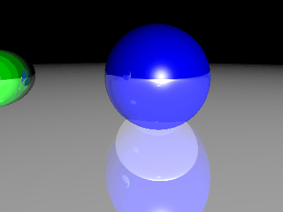
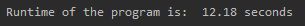

# Ray Tracer!
This is a basic raytracer developed with Python using Computer Graphics, Multi-Processing and unittesting techniques.With this project, i've enhanced my skills in these branches.This raytracer supports blinn-phong lighting,reflection,shadows and depth.This raytracer only supports Sphere objects currently.

## What is Ray tracing ?
In 3D computer graphics, ray tracing is a rendering technique for generating an image by tracing the path of light as pixels in an image plane and simulating the effects of its encounters with virtual objects. The technique is capable of producing a high degree of visual realism, more so than typical scanline rendering methods, but at a greater computational cost. This makes ray tracing best suited for applications where taking a relatively long time to render can be tolerated, such as in still computer-generated images, and film and television visual effects (VFX), but generally more poorly suited to real-time applications such as video games, where speed is critical in rendering each frame.

Source : https://en.wikipedia.org/wiki/Ray_tracing_(graphics)

## Logic of this raytracer
A camera is placed on a 3D environment and rays are cast from camera's position to points on 3D image plane. Each ray represents a pixel in the final image and color of the ray which we determine via using RayTracing techniques, determines the color of that pixel.When forming the pixels, the program will use all of your available CPU cores to speed up the process.The program will animate these final images by creating 4 frames with Sphere objects placed differently and play them back to back via using imageio library.The output of this program will be .gif file consists of 4 frames played back-to-back like the one below:



The time it takes to produce this .gif file:



## How to run ?
Download the source code and type
```
C:\.\BasicRayTracer-Python python3 main.py
```
to your cmd.

## Requirements

* Python 3.7 or above
* If you want to run Test.py to test the vector class which this program uses frequently: ``` pip install unittest ``` 
* For animation : ``` pip install imageio ```
* Because this program uses PPM files, you need to download an extension of imageio to animate : ``` imageio_download_bin freeimage ``` to cmd.
* A PPM file viewer

## Resources

- https://raytracing.github.io/books/RayTracingInOneWeekend.html
- https://medium.com/swlh/ray-tracing-from-scratch-in-python-41670e6a96f9
- https://www.youtube.com/c/ArunRavindranRocks/

## Contact
Feel free to contact me at : `yektabuyukkaya@outlook.com`
